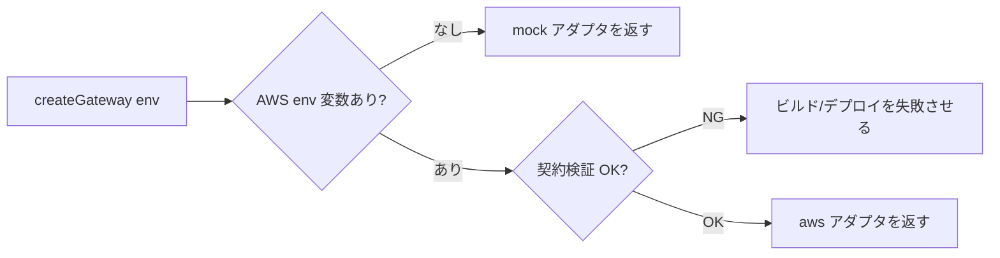

# Design Document: ehime-tourism-app

## Overview

愛媛観光支援 Web アプリ（React）の設計書です。**通常観光モード**（AI チャット相談・スワイプ発見・お気に入り・しおり・共有）と **お遍路モード**（札所マップ・巡礼進捗/達成率・デジタル納経帳・今日のお遍路プラン・到着自動表示・重ねるマップ）の 2 モードを提供します。

設計上の中心方針は次の 3 点です。

1. **AWS 依存の抽象化**: AI（Bedrock）・地図/現在地（Location Service）・データ永続化（DynamoDB/S3）・認証・翻訳（Translate）はすべて `AWS_Gateway` のポート（インターフェース）背後に隔離し、当面はモック実装（`mock/` アダプタ）で動作させる。Vercel デプロイ時は環境変数が無ければ自動的にモックへフォールバックする。これにより純粋なドメインロジック（達成率計算・スワイプ分類・しおり並べ替え・ジオフェンス判定・レイヤー絞り込み）を AWS から切り離してテスト可能にする。
2. **純粋ドメイン層の分離**: 計算・判定・並べ替え・分類などの中核ロジックを副作用のない純粋関数として `domain/` に置き、Property-Based Testing（PBT）で広範に検証する。UI / 永続化 / 外部 API は薄いアダプタとする。
3. **手作り感のあるデザイン**: 機械的・量産的に見えないトーン（要件 18）をデザイントークンとコンポーネント方針として定義する。

> **基盤突合に関する注記**: 既存基盤 `waskiro`（現在アクセス不可）との整合は後日行う。本設計はフレームワーク非依存のドメイン層を中心に据えることで、既存基盤の UI/ルーティングへ後から接合しやすい構造とする。

### MVP スコープ vs 後続フェーズ（A6 / Q5・Q6・Q7）

本設計は全機能（後述のポート・コンポーネント・Correctness Properties）を将来仕様として保持しつつ、初期リリース（MVP）で実装する範囲を以下のとおり明確化する。設計上のインターフェースは変更せず、各機能が MVP か後続フェーズかを注記することで、実装順序と段階的拡張を可能にする。

**MVP に含む（中核体験）**

- **札所マップ**: 愛媛 26 札所の番号付きピン・詳細・フィルタ・モック現在地（`TempleMap` / Req 8）。
- **手動訪問記録**: スクロールによる「行った/行ってない」設定（`VisitTrackerScroll` / Req 11）と、納経帳の手動記録（`NokyochoView` / Req 10）。**写真はローカル保存（プレースホルダー）**で MVP に含む（Q6）。
- **達成率表示**: 愛媛 26 札所・四国 88 札所の訪問数と達成率（`ProgressDashboard` / Req 9）。
- **基本レイヤー**: 重ねるマップは **お遍路／トイレ／休憩所** の基本レイヤーのみ（`LayeredMap` / Req 14.6）。

**後続フェーズ（設計は保持・実装は後日）**

- **ジオフェンス自動表示（Q5）**: 札所接近/到着の自動検知と自動表示（`ArrivalSheet` / `MapLocationPort.watchGeofences` / Req 13.1）。MVP では Req 13.4 の手動到着記録のみ対象。
- **AI 今日のお遍路プラン**: 条件入力からの当日プラン生成（`PilgrimagePlanner` / Req 12）。
- **全レイヤー統合（Q7）**: サイクリング／グルメ／防災レイヤーの統合と横断周遊提案（`LayeredMap` / Req 14.1〜14.5）。
- **SNS ログイン（Q8）**: メール＋パスワード以外の認証手段。

> ポート（`watchGeofences` 等）と Correctness Properties（Property 22〜25 等の後続機能分を含む全 28 個）は将来実装の契約として **そのまま維持** する。MVP の実装タスクでは、後続フェーズに属するプロパティのテストは該当機能の実装時に有効化する。

### 研究メモ（設計に反映した調査結果）

- **MLIT 多言語解説文データベース**（`mlit.go.jp/tagengo-db`）: 観光資源ごとに多言語解説文を持つ。資源 ID をキーにした解説テキスト（複数言語）を返す形式であり、本アプリの「札所/スポット解説の多言語表示」のデータモデル（`localizedDescriptions: Record<LangCode, string>`）の根拠とした。([howto](https://www.mlit.go.jp/tagengo-db/howto.html))
- **文化庁 日本遺産**（`japan-heritage.bunka.go.jp`）: 四国遍路の文化的文脈・ストーリー情報源。札所の `history` / `highlights` フィールドの内容源として参照。
- **愛媛の札所**: 四国八十八ヶ所のうち愛媛県は **第40番（観自在寺）〜第65番（三角寺）の計 26 ヶ寺**。モックデータの初期セットはこの 26 札所を基準とする（番号レンジ 40–65）。
- **データ出典の確定（Q1/Q2/Q3）**:
  - **札所の正典（Q1）**: 本番では **四国八十八ヶ所霊場会（`shikoku88.net`）を札所番号・名称の正典**とし、位置情報はそれを補完する。多言語解説は上記 MLIT 多言語観光 DB、歴史／見どころは文化庁 日本遺産を出典とする。
  - **施設データ（Q2）**: トイレ・休憩所・駐車場は **国土数値情報＋自治体オープンデータ**を想定する。モック段階では札所ごとに `parking` / `restrooms` フラグのダミー値を用いる。
  - **スポット／飲食店（Q3）**: モックは **ダミーデータ**を用いる。本番の入手元・利用条件確認は後続課題として保留し、**Tabelog 等の外部サービスの無断利用は行わない**（口コミは自前または正式提供データを前提）。
- 内容は要約・言い換えのうえ反映（ライセンス順守のため原文の逐語転載はしていない）。

## Architecture

### レイヤー構成

```mermaid
graph TD
    subgraph UI["UI 層 (React)"]
        TOUR[通常観光モード画面]
        OHENRO[お遍路モード画面]
        SHELL[App Shell / ルーティング / 言語・モード切替]
    end
    subgraph APP["アプリケーション層 (hooks / state)"]
        STORE[状態管理ストア]
        SVC[ユースケースサービス]
    end
    subgraph DOMAIN["ドメイン層 (純粋関数・PBT 対象)"]
        PROG[達成率計算]
        SWIPE[スワイプ分類]
        SHIORI[しおり並べ替え]
        GEO[ジオフェンス判定]
        LAYER[レイヤー絞り込み]
        I18N[言語フォールバック]
    end
    subgraph PORTS["AWS_Gateway ポート (interface)"]
        AIP[ChatPort]
        MAPP[MapLocationPort]
        STORP[StoragePort]
        AUTHP[AuthPort]
        TRANSP[TranslatePort]
    end
    subgraph ADAPTERS["アダプタ"]
        MOCK[mock/ 実装]
        AWS[aws/ 実装 (後日)]
    end

    UI --> APP
    APP --> DOMAIN
    APP --> PORTS
    PORTS --> ADAPTERS
    MOCK -.default.-> PORTS
    AWS -.env 設定時.-> PORTS
```

### 技術スタックと配置

- **フロントエンド**: React + TypeScript（Vite ビルド）。Vercel へデプロイ。
- **状態管理**: 軽量ストア（React context + reducer、または Zustand 相当）。永続化は `StoragePort` 経由。
- **ルーティング**: クライアントルーティング（言語選択 → モード選択 → 各モード画面）。
- **AWS_Gateway**: TypeScript インターフェース群。`createGateway(env)` がファクトリとして、環境変数の有無で `mock` / `aws` アダプタを選択する。
- **デプロイ**: Vercel（静的 + サーバーレス関数）。AWS 接続情報は環境変数。未設定時はモック。

### ポート選択ロジック



## Components and Interfaces

### AWS_Gateway ポート（抽象インターフェース）

```typescript
// すべて mock と aws で同一契約を維持する (Req 16.1, 16.4)

interface ChatPort {
  // AI チャット相談・プラン生成
  sendMessage(session: ChatSession, message: string): Promise<ChatReply>;
  generatePilgrimagePlan(input: PlanInput): Promise<PilgrimagePlan>;
}

interface MapLocationPort {
  getTemples(area: ShikokuPrefecture): Promise<Temple[]>;
  getCurrentLocation(): Promise<GeoPoint | null>;
  // ジオフェンス進入イベント購読 (Req 13)
  watchGeofences(fences: Geofence[], onEnter: (templeId: string) => void): Unsubscribe;
}

interface StoragePort {
  load<T>(key: StorageKey): Promise<T | null>;
  save<T>(key: StorageKey, value: T): Promise<void>;
  // オフライン同期キュー (Req 13.5, 13.6)
  enqueueOffline(entry: OfflineEntry): Promise<void>;
  flushOffline(): Promise<OfflineEntry[]>;
}

interface AuthPort {
  login(email: string, password: string, remember: boolean): Promise<Session | null>;
  logout(): Promise<void>;
  currentSession(): Promise<Session | null>;
}

interface TranslatePort {
  translate(text: string, target: LangCode): Promise<string>;
}
```

### コンポーネント一覧（責務）

| コンポーネント | 責務 | 関連要件 |
|---|---|---|
| `LanguageSelect` | 言語一覧表示・選択・保存 | 1 |
| `ModeSelect` / `ModeManager` | 言語選択後のモード選択画面提示、および以降のヘッダー＋設定画面トグルによる観光/お遍路モード切替・状態保持（両採用 / Q4） | 2 |
| `ChatAdvisor` | AI 会話・提案、スワイプ候補引き渡し | 3 |
| `SwipeDeck` | カード提示・4 方向スワイプ・おすすめ | 4 |
| `FavoritesView` | お気に入り一覧・タブ分類・詳細 | 5 |
| `ShioriEditor` | しおり項目追加・並べ替え・削除 | 6 |
| `PlanShare` | プラン共有リンク生成・閲覧 | 7 |
| `TempleMap` | 札所ピン・詳細・フィルタ・現在地 | 8, 20 |
| `ProgressDashboard` | 達成率・残数・今日/今月集計 | 9 |
| `NokyochoView` | 訪問記録の保存・一覧・詳細 | 10 |
| `VisitTrackerScroll` | 行った/行ってないスクロール設定 | 11 |
| `PilgrimagePlanner` | 条件入力・当日プラン生成・タイムライン | 12 |
| `ArrivalSheet` | 到着自動表示・記録/しおり追加 | 13 |
| `LayeredMap` | 情報レイヤー重畳・絞り込み | 14, 20 |
| `MapCanvas` | 実地図タイル描画（Amazon Location + MapLibre）。ピン/現在地/レイヤーを地理座標に重畳。未設定/失敗時はモックサーフェスへ退避 | 20 |
| `AuthGate` | メールログイン・セッション保持 | 15 |
| デザイントークン / 共通 UI | 配色・トーン・スワイプ UI | 18 |

### 実地図描画（Map_Renderer / Req 20）

`TempleMap` / `LayeredMap` の地図表示は、共有プレゼンテーション層 **`MapCanvas`** に集約する。`MapCanvas` は地理座標（緯度経度）でピン・現在地・レイヤー要素を受け取り、次の 2 モードのいずれかで描画する。

- **実地図モード（MapLibre GL JS）**: 実地図描画が有効化されている場合。**MapLibre GL JS** で **オープンな地図タイル源（既定: OpenStreetMap ラスタタイル、APIキー不要）** を読み込み、ピン/現在地は MapLibre の Marker として地理座標に配置する。ズーム/パンしても整合を保つ（Req 20.1–20.3）。Amazon Location Service など特定クラウドには依存しない。
- **モックサーフェスモード（フォールバック）**: 実地図が無効、または WebGL 初期化に失敗した場合。既存の百分率投影サーフェス（`temple-map__surface` と `buildProjector`）をそのまま用い、`data-testid` 等の既存契約を維持する（Req 20.4 / 20.7、Req 8.5 / 16.2 / 17.3 整合）。テスト環境（jsdom は WebGL 非対応）でも自動的にこのモードになるため、既存テストは不変。

**有効化と既定（Req 20.1 / 20.5）**: 実地図モードは環境変数フラグ `VITE_MAP_ENABLED="true"` で有効化する（既定は無効＝モックサーフェス）。タイル/スタイルは既定で内蔵の OpenStreetMap ラスタスタイルを用い、`VITE_MAP_STYLE_URL`（任意）で別スタイルへ差し替え可能。ブラウザに AWS 認証情報や秘匿キーは保持しない（OSM 既定タイルはキー不要）。

**現在地（Req 20.6）**: 実 `MapLocationPort` アダプタの `getCurrentLocation` はブラウザ `navigator.geolocation` を用い、未許可/不可ならモック現在地へフォールバックする。`getTemples` は当面 A7 の愛媛 26 札所キュレーションデータを返す。

**依存追加**: `maplibre-gl`（実地図描画）のみ。タイル源が OSM のため追加の認可ライブラリやクラウド SDK は不要。

**環境変数（クライアント / Req 17.2 整合）**: `VITE_MAP_ENABLED`（実地図有効化）・`VITE_MAP_STYLE_URL`（任意のスタイル差し替え）。AI 用の `VITE_AWS_API_ENDPOINT` とは独立に判定する。OSM の公開タイルは利用ポリシー順守の範囲（MVP/デモ）で用い、本番大規模時は自前/商用タイルへ差し替える。

### ドメイン層の主な純粋関数

```typescript
// 達成率 (Req 9.3): 切り捨て百分率
function achievementRate(visitedCount: number, total: number): number;

// スワイプ分類 (Req 4.2-4.5)
type SwipeDir = "right" | "left" | "up" | "down";
function classifySwipe(dir: SwipeDir): "favorite" | "skip" | "shiori" | "later";

// しおり並べ替え (Req 6.2): 純粋な順序操作
function reorder<T>(items: T[], from: number, to: number): T[];

// ジオフェンス判定 (Req 13.1)
function isInsideGeofence(p: GeoPoint, fence: Geofence): boolean;

// レイヤー絞り込み (Req 14.1-14.3)
function filterByLayers(features: MapFeature[], active: LayerKind[]): MapFeature[];

// 言語フォールバック (Req 1.6, 19.3)
function resolveLabel(dict: LangDict, lang: LangCode, key: string): string;

// 訪問集計の更新 (Req 9.4, 11.4)
function applyVisit(state: ProgressState, templeId: string, visited: boolean): ProgressState;
```

## Data Models

```typescript
type LangCode =
  | "ja" | "en" | "zh-Hans" | "zh-Hant" | "ko" | "th" | "fr" | "de"
  | "es" | "pt" | "vi" | "id" | "ar" | "ru" | "hi" | "iyo"; // iyo = 伊予弁

type ShikokuPrefecture = "ehime" | "kagawa" | "tokushima" | "kochi";

interface GeoPoint { lat: number; lng: number; }

interface Temple {
  id: string;
  number: number;            // 札所番号 (>=1, 愛媛は 40-65)
  name: string;              // 札所名 (例: 石手寺)
  prefecture: ShikokuPrefecture;
  location: GeoPoint;
  address: string;
  localizedDescriptions: Partial<Record<LangCode, string>>; // MLIT-DB 由来想定
  history?: string;
  highlights: string[];      // 見どころ
  photoSpots: string[];
  parking: boolean;
  restrooms: boolean;        // トイレ/休憩所
  imageUrls: string[];       // 当面プレースホルダー (Req 4.7)
}

interface Spot {              // 観光スポット/飲食店
  id: string;
  name: string;
  category: "sightseeing" | "food" | "souvenir" | "onsen";
  location: GeoPoint;
  localizedDescriptions: Partial<Record<LangCode, string>>;
  popularityRank?: number;
  reviews: Review[];
  imageUrls: string[];       // プレースホルダー
}

interface Review { author: string; rating: number; text: string; }

interface Favorite { itemId: string; itemType: "spot" | "temple"; addedAt: string; }

interface ShioriItem { itemId: string; order: number; note?: string; }
interface Shiori { id: string; title: string; items: ShioriItem[]; }

interface VisitRecord {
  templeId: string;
  visitDate: string;         // ISO 日付
  photos: string[];          // MVP: ローカル保存(プレースホルダー), 本番: S3 差し替え (Q6/Req 10.4,10.5)
  memo?: string;
  route?: string;
  impression?: string;
}

interface ProgressState {
  area: ShikokuPrefecture;        // 選択中の対象県 (Req 9.6)
  visited: Set<string>;           // 訪問済 templeId
  templesByArea: Record<ShikokuPrefecture, string[]>;
  shikokuTotal: number;           // 88
}

type LayerKind = "ohenro" | "cycling" | "gourmet" | "disaster" | "restroom" | "rest_area";
interface MapFeature { id: string; layer: LayerKind; location: GeoPoint; label: string; }

interface Geofence { templeId: string; center: GeoPoint; radiusMeters: number; } // 既定 100m

interface PlanInput {
  startPoint: GeoPoint | string;
  availableMinutes: number;
  transport: "walk" | "car" | "bike";
  desiredTemples: string[];
  fitnessLevel: "low" | "mid" | "high";
  includeSightseeing: boolean;
}
interface PlanStop { time: string; label: string; kind: "temple" | "spot" | "meal"; }
interface PilgrimagePlan { stops: PlanStop[]; }

interface Session { userId: string; email: string; expiresAt: string | null; }
interface OfflineEntry { kind: "arrival"; templeId: string; at: string; }
```

### 永続化キー（StoragePort）

`favorites` / `shiori` / `visitRecords` / `progress` / `language` / `mode` / `session` / `offlineQueue`。当面は `mock` 実装（メモリ + ブラウザ localStorage）。

> **写真保存の方針（Q6 / Req 10.4, 10.5）**: `VisitRecord.photos` および納経帳（`Nokyocho`）の添付写真は、**MVP では端末ローカル保存（プレースホルダー）**とし、`StoragePort` 経由で扱う。**本番では `StoragePort` の `aws` アダプタにて S3 保存へ差し替える**（インターフェース契約は不変）。写真以外の訪問記録フィールドは Property 12（永続化の往復一致）の対象として維持する。

## Correctness Properties

*プロパティとは、システムの全ての妥当な実行において成り立つべき特性・振る舞いであり、システムが「何をすべきか」についての形式的な言明です。プロパティは人間可読な仕様と機械検証可能な正しさ保証の橋渡しになります。*

本機能は純粋なドメインロジック（達成率計算・スワイプ分類・並べ替え・ジオフェンス判定・レイヤー絞り込み・言語フォールバック・コレクション操作・永続化往復）を多く含むため、これらに対し Property-Based Testing を適用します。AI 応答・地図/現在地・実 AWS 接続などの外部依存は PBT 対象外（INTEGRATION/SMOKE）とし、テスト戦略で別途扱います。

### Property 1: 言語選択の保存

*任意の* 有効な言語コードについて、その言語を選択して「次へ進む」を行うと、保存された表示言語は選択した言語コードと一致する。

**Validates: Requirements 1.3**

### Property 2: 言語フォールバックは常に文字列を返す

*任意の* 言語辞書・言語コード・ラベルキーについて、ラベル解決は常に非 null の文字列を返し、対象言語の値が欠落している場合は日本語(ja)の値（無ければ原文/キー）を返す。

**Validates: Requirements 1.6, 19.1, 19.3**

### Property 3: モード切替の状態保持（往復）

*任意の* アプリ状態について、モードを切り替えて元のモードへ戻すと、保持対象の状態は元の状態と一致する。

**Validates: Requirements 2.1, 2.2, 2.3, 2.5**

### Property 4: スワイプ嗜好の提案入力反映

*任意の* スワイプ履歴について、AI 提案要求に渡される入力ペイロードには当該履歴が反映されている。

**Validates: Requirements 3.3**

### Property 5: スワイプ方向の分類

*任意の* スワイプ方向について、分類関数は 右→「行きたい(お気に入り)」、左→「興味なし(スキップ)」、上→「しおりに追加」、下→「後で見る」 を返す。

**Validates: Requirements 4.2, 4.3, 4.4, 4.5**

### Property 6: おすすめは興味なし項目を含まない

*任意の* スワイプ履歴について、生成される「あなたへのおすすめ」集合には、左スワイプ（興味なし）と評価済みの項目が一切含まれない。

**Validates: Requirements 4.6**

### Property 7: スポットカード描画は必須情報を含む

*任意の* スポットについて、スワイプカードの描画結果には名称・写真（または欠落時はプレースホルダー）・紹介文・人気ランキング・口コミが全て含まれる。

**Validates: Requirements 4.1, 4.7**

### Property 8: お気に入りの追加/削除メンバーシップ

*任意の* お気に入り集合と項目について、項目を追加すると一覧に含まれ、削除すると含まれない。

**Validates: Requirements 5.1, 5.3**

### Property 9: お気に入りのタブ分類の網羅性と排他性

*任意の* お気に入り集合について、各タブ（スポット/しおり/プラン）の和集合は「すべて」タブと一致し、各項目はその型に対応する唯一のタブに分類される。

**Validates: Requirements 5.2**

### Property 10: しおりの追加/削除メンバーシップ

*任意の* しおりと項目について、項目を追加するとしおりに含まれ、削除すると含まれない。

**Validates: Requirements 6.1, 6.3**

### Property 11: しおり並べ替えは要素を保存する

*任意の* リストと有効な from/to 位置について、並べ替え後のリストは長さが不変で、要素の多重集合が元と一致し、移動対象要素が指定位置に存在する。

**Validates: Requirements 6.2**

### Property 12: 永続化の往復一致

*任意の* 永続化対象（しおり・訪問記録など）について、保存してから読み込むと元の値と同値になる。

**Validates: Requirements 6.4, 10.1, 10.5**

### Property 13: 共有の往復一致

*任意の* プランについて、共有データを生成してから開くと元のプランを復元できる。

**Validates: Requirements 7.1, 7.2**

### Property 14: 札所ピン数は札所数と一致

*任意の* 愛媛札所集合について、地図に表示されるピン数は札所数と一致する。

**Validates: Requirements 8.1**

### Property 15: 札所詳細の必須項目と制約

*任意の* 札所について、詳細表示には札所番号・札所名・距離・所要時間・駐車場有無・トイレ/休憩所・周辺情報が含まれ、札所番号は 1 以上、所要時間は 0 以上である。

**Validates: Requirements 8.2**

### Property 16: 札所フィルタは条件を満たす部分集合を返す

*任意の* 札所集合とフィルタ条件（車/徒歩/時間/未訪問のみ）について、結果は元集合の部分集合であり、結果の全要素が条件を満たす。

**Validates: Requirements 8.3**

### Property 17: 達成率計算

*任意の* 訪問済数 visited と総数 total（total>0、0<=visited<=total）について、達成率は floor(visited / total * 100) に等しく、0 以上 100 以下であり、visited=0 のとき 0、visited=total のとき 100 になる。

**Validates: Requirements 9.1, 9.2, 9.3**

### Property 18: 訪問追加の単調性

*任意の* 進捗状態について、未訪問の札所を訪問済にすると訪問数がちょうど 1 増え、達成率は減少しない。

**Validates: Requirements 9.4**

### Property 19: 残数の不変条件

*任意の* 進捗状態について、残りの札所数と訪問済札所数の和は対象範囲の札所総数に等しい。

**Validates: Requirements 9.5**

### Property 20: 対象県選択による範囲限定

*任意の* 四国 4 県のうち選択された県について、進捗計算の対象札所集合は当該県の札所集合と一致する。

**Validates: Requirements 9.6**

### Property 21: 訪問状態トグルの往復

*任意の* 札所について、訪問状態を true→false→true（または false→true→false）とトグルすると、進捗状態は最初の状態と一致する。

**Validates: Requirements 11.3, 11.4**

### Property 22: 巡礼プランのタイムラインは時刻昇順

*任意の* 巡礼プランについて、タイムライン表示の stops は時刻の昇順に並び、空プランでも例外なく描画できる。

**Validates: Requirements 12.2**

### Property 23: ジオフェンス内外判定

*任意の* 地点とジオフェンス（中心・半径）について、地点が「内側」と判定されるのは中心からの距離が半径以下であるときに限る。中心は常に内側、半径を超える地点は外側になる。

**Validates: Requirements 13.1**

### Property 24: オフライン到着ログ同期の往復

*任意の* 到着ログ列について、全件をオフラインキューへ投入してから同期(flush)すると、同期結果は投入した全ログの集合と一致し、再度の同期では空になる（重複同期しない）。

**Validates: Requirements 13.5, 13.6**

### Property 25: レイヤー重畳の厳密一致

*任意の* 地図要素集合とアクティブなレイヤー集合について、表示される要素は「レイヤーがアクティブ集合に含まれる要素」と厳密に一致する（重畳・解除・複数同時選択を含む）。

**Validates: Requirements 14.1, 14.2, 14.3**

### Property 26: 認証成功時のみセッション確立

*任意の* 資格情報について、正しい資格情報ではセッションが生成され、誤った資格情報ではセッションは生成されず（null）失敗メッセージが提示される。

**Validates: Requirements 15.1, 15.3**

### Property 27: ログイン保持の往復

*任意の* 確立済みセッションについて、「ログイン状態を保持する」が true なら保存後の再取得で同一セッションが得られ、false なら保持されない。

**Validates: Requirements 15.2**

### Property 28: ログアウトでセッション破棄

*任意の* 確立済みセッションについて、ログアウト後に現在セッションを取得すると null になる。

**Validates: Requirements 15.4**

## Error Handling

- **AI 応答失敗（Req 3.4, 12.4）**: `ChatPort` が reject した場合、UI はエラーメッセージと再試行操作を必ず両方提示する。再試行は同一入力で `sendMessage` / `generatePilgrimagePlan` を再実行する。
- **言語リソース欠落（Req 1.6）**: 翻訳キー欠落時は通知せず日本語へフォールバック。`resolveLabel` は決して例外を投げない。
- **ラベル部分更新失敗（Req 1.5）**: 一部ラベル更新失敗時も更新可能分を反映し、言語変更を中断しない。
- **永続化失敗（Req 11.2）**: 訪問状態などの保存が失敗した場合、UI 状態は維持しユーザー操作を継続させる（サイレントフェイル、データは失われ得る）。失敗はログに記録する。
- **共有プラン不在（Req 7.3）**: 共有 id が存在しない場合「プランが見つからない」旨を表示する。
- **現在地取得不可（Req 13.4）**: 位置取得不可時は手動の到着記録操作を提供する。
- **通信切断（Req 13.5, 13.6）**: 到着ログを `enqueueOffline` で端末ローカルへ退避し、復帰時に `flushOffline` で同期。同期は冪等（二重実行で重複しない）。
- **AWS 未接続（Req 16.2, 17.3, 19.3）**: env 未設定時は `createGateway` がモックアダプタを返し全機能を成立させる。翻訳は他ソース取得を試みた上でモック/原文へフォールバック。
- **契約不一致（Req 16.4）**: mock と aws のインターフェース契約が型レベルで一致しない場合、ビルド/デプロイを失敗させる（型検査と契約テストで担保）。

## Testing Strategy

### 二層テスト方針

- **ユニット/例示テスト**: 具体例・エッジケース・エラー条件・UI 配線（INTEGRATION/SMOKE/EXAMPLE/EDGE_CASE 分類のもの）。
- **プロパティテスト**: 上記 Correctness Properties（PROPERTY 分類）を網羅。純粋ドメイン関数とモックアダプタに対して実施。

### プロパティテストの構成

- ライブラリは TypeScript 向けの **fast-check** を使用（スクラッチ実装しない）。
- 各プロパティテストは **最低 100 回**の反復で実行する。
- 各テストは設計のプロパティ番号を参照するコメントを付す。
  - タグ形式: `Feature: ehime-tourism-app, Property {番号}: {プロパティ本文}`
- 各 Correctness Property は **単一のプロパティテスト**として実装する。
- ジェネレータはエッジケース（空辞書・空リスト・全角/非 ASCII 文字列・border 距離=半径ちょうど・visited=0/visited=total・画像欠落 等）を含むように設計する。

### 例示/統合/スモークテスト（PBT 非対象）

- **INTEGRATION**: モックアダプタを用いた 1–3 例。AI チャット応答表示（3.1）、プラン生成（12.1）、現在地/モック地図（8.4/8.5）、翻訳取得（19.2）、`createGateway` のアダプタ選択（3.6/16.2）。
- **SMOKE**: Vercel ビルド成功・環境変数読込（17.1/17.2）、mock⇔aws 契約一致の型/契約テスト（16.1–16.4）、デザイントークン適用のスナップショット（18.1/18.2）、会話トーンは人手レビュー（3.5/18.3）。
- **EXAMPLE/EDGE_CASE**: 言語選択画面初回表示（1.1）、言語一覧（1.2）、設定の言語変更操作（1.4）、ラベル部分更新（1.5）、スワイプ候補引き渡し（3.2）、AI 失敗時のエラー＋再試行（3.4/12.4）、関連 0 件詳細（5.4）、共有不在（7.3）、初回スクロール画面（11.1）、永続化失敗時 UI 維持（11.2）、観光非含有プラン（12.3）、到着画面操作（13.2/13.3）、手動到着記録（13.4）、ハザード表示（14.5）、モード別画面マウント（18.4/18.5）。

### 検証順序

ドメイン純粋関数 → アダプタ（モック）→ UI コンポーネント → モード横断の統合、の順で検証する。プロパティテストは対応する実装タスクの直後に配置し、早期にロジックの正しさを担保する。
