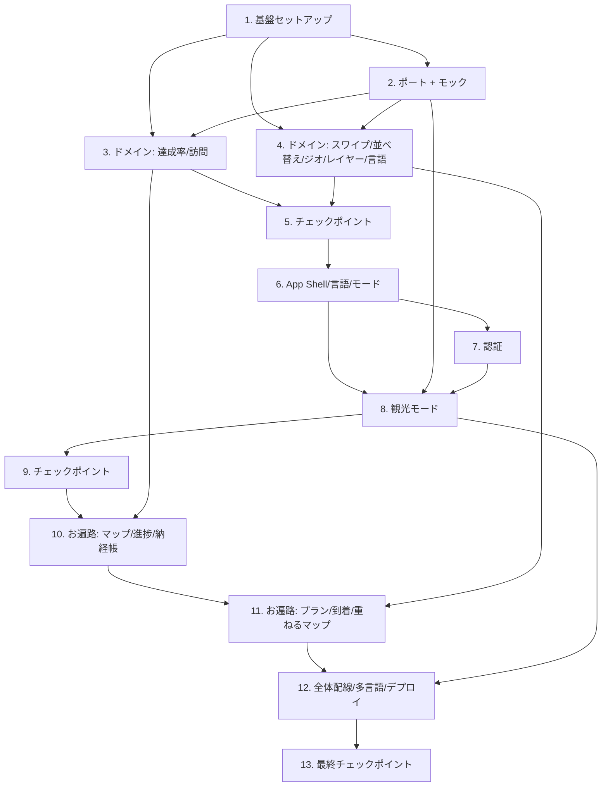

# Implementation Plan: ehime-tourism-app

## Overview

React + TypeScript（Vite）で実装し Vercel へデプロイする。AWS 依存はすべて `AWS_Gateway` ポート背後に隔離し、当面はモックアダプタで動作させる。純粋ドメイン層を先に確立して fast-check によるプロパティテスト（各最低 100 回反復）で検証し、その上に UI を積み上げて最後に全体を配線する。各タスクは前のタスクの成果物の上に構築し、孤立したコードを残さない。

`*` 付きサブタスクは任意（テスト系）であり、スキップ可能。エージェントは `*` 付きを実装せず、`*` の無いタスクを実装する。

### MVP スコープと後続フェーズ

本計画は MVP（最小実用版）を基本スコープとし、一部機能を「後続フェーズ（Post-MVP）」として明示的に後回しにする。実装者は「（後続フェーズ / Post-MVP）」ラベルが付いたタスク/サブタスクを MVP では実装対象外として扱うこと。

- **MVP に含む**: 言語選択・モード管理、認証、観光モード一式（チャット/スワイプ/お気に入り/しおり/共有）、お遍路マップ・進捗・納経帳・訪問管理（手動到着記録を含む）、オフライン退避→復帰同期、重ねるマップの基本レイヤー（お遍路/トイレ/休憩所）。
- **後続フェーズ（Post-MVP）に回す**: 「今日のお遍路プラン」AI 生成（11.1）、ジオフェンスによる札所到着の自動表示（11.4 の自動表示部分）、重ねるマップの全レイヤー統合（サイクリング/グルメ/防災）とクロス属性候補（11.5 / 14.4）。
- 後続フェーズのタスクも構成・依存把握のため計画上は残すが、MVP リリースでは未実装で構わない。各タスク内の注記を参照のこと。

## Task Dependency Graph



```json
{
  "waves": [
    { "wave": 1, "tasks": ["1"] },
    { "wave": 2, "tasks": ["2", "3", "4"] },
    { "wave": 3, "tasks": ["5"] },
    { "wave": 4, "tasks": ["6"] },
    { "wave": 5, "tasks": ["7", "8"] },
    { "wave": 6, "tasks": ["9"] },
    { "wave": 7, "tasks": ["10"] },
    { "wave": 8, "tasks": ["11"] },
    { "wave": 9, "tasks": ["12"] },
    { "wave": 10, "tasks": ["13"] }
  ]
}
```

## Tasks

- [x] 1. プロジェクト基盤のセットアップ
  - Vite + React + TypeScript プロジェクトを初期化
  - fast-check とテストランナー（Vitest）を導入・設定
  - ディレクトリ構成を作成（`domain/`, `ports/`, `adapters/mock/`, `adapters/aws/`, `app/`, `ui/`, `i18n/`）
  - Vercel デプロイ設定（ビルド出力、環境変数の読み込み口）を追加
  - _Requirements: 17.1, 17.2_

- [x] 2. AWS_Gateway ポートとモックアダプタ
  - [x] 2.1 ポートインターフェースを定義
    - `ChatPort` / `MapLocationPort` / `StoragePort` / `AuthPort` / `TranslatePort` を TypeScript interface として定義
    - 共有データ型（`Temple`, `Spot`, `Session`, `OfflineEntry` 等）を定義
    - _Requirements: 16.1_
  - [x] 2.2 モックアダプタを実装
    - 各ポートのモック実装（メモリ + localStorage、固定/疑似データ）
    - `StoragePort` の `enqueueOffline` / `flushOffline`（冪等同期）を実装
    - _Requirements: 16.2, 13.5, 13.6_
  - [x] 2.3 `createGateway(env)` ファクトリと契約検証を実装
    - env 変数の有無で mock / aws アダプタを選択（未設定→mock）
    - mock⇔aws の契約不一致時にビルド/デプロイを失敗させる型・契約検証
    - _Requirements: 16.2, 16.3, 16.4, 17.3_
  - [ ]* 2.4 永続化往復のプロパティテスト
    - **Property 12: 永続化の往復一致**
    - **Validates: Requirements 6.4, 10.1, 10.5**
  - [ ]* 2.5 オフライン同期のプロパティテスト
    - **Property 24: オフライン到着ログ同期の往復**
    - **Validates: Requirements 13.5, 13.6**
  - [ ]* 2.6 アダプタ選択の統合テスト
    - env 無しで mock を返すことを確認（INTEGRATION/SMOKE）
    - _Requirements: 3.6, 16.2, 16.4, 17.3_

- [x] 3. ドメイン層: 達成率・訪問管理
  - [x] 3.1 達成率計算と進捗状態の純粋関数を実装
    - `achievementRate`, `applyVisit`, 残数算出, 対象県限定 を実装
    - _Requirements: 9.1, 9.2, 9.3, 9.4, 9.5, 9.6_
  - [ ]* 3.2 達成率計算のプロパティテスト
    - **Property 17: 達成率計算**
    - **Validates: Requirements 9.1, 9.2, 9.3**
  - [ ]* 3.3 訪問追加の単調性のプロパティテスト
    - **Property 18: 訪問追加の単調性**
    - **Validates: Requirements 9.4**
  - [ ]* 3.4 残数不変条件のプロパティテスト
    - **Property 19: 残数の不変条件**
    - **Validates: Requirements 9.5**
  - [ ]* 3.5 対象県限定のプロパティテスト
    - **Property 20: 対象県選択による範囲限定**
    - **Validates: Requirements 9.6**
  - [ ]* 3.6 訪問トグル往復のプロパティテスト
    - **Property 21: 訪問状態トグルの往復**
    - **Validates: Requirements 11.3, 11.4**

- [x] 4. ドメイン層: スワイプ・並べ替え・ジオフェンス・レイヤー・言語
  - [x] 4.1 スワイプ分類とおすすめ算出を実装
    - `classifySwipe`, スワイプ履歴→おすすめ生成（興味なし除外）, 提案入力ペイロード生成
    - _Requirements: 4.2, 4.3, 4.4, 4.5, 4.6, 3.3_
  - [ ]* 4.2 スワイプ分類のプロパティテスト
    - **Property 5: スワイプ方向の分類**
    - **Validates: Requirements 4.2, 4.3, 4.4, 4.5**
  - [ ]* 4.3 おすすめ除外のプロパティテスト
    - **Property 6: おすすめは興味なし項目を含まない**
    - **Validates: Requirements 4.6**
  - [ ]* 4.4 嗜好反映のプロパティテスト
    - **Property 4: スワイプ嗜好の提案入力反映**
    - **Validates: Requirements 3.3**
  - [x] 4.5 しおり並べ替え・フィルタ・ジオフェンス・レイヤー・言語解決を実装
    - `reorder`, 札所フィルタ, `isInsideGeofence`(haversine), `filterByLayers`, `resolveLabel`
    - _Requirements: 6.2, 8.3, 13.1, 14.1, 14.2, 14.3, 1.6, 19.1, 19.3_
  - [ ]* 4.6 並べ替え保存のプロパティテスト
    - **Property 11: しおり並べ替えは要素を保存する**
    - **Validates: Requirements 6.2**
  - [ ]* 4.7 札所フィルタのプロパティテスト
    - **Property 16: 札所フィルタは条件を満たす部分集合を返す**
    - **Validates: Requirements 8.3**
  - [ ]* 4.8 ジオフェンス判定のプロパティテスト
    - **Property 23: ジオフェンス内外判定**
    - **Validates: Requirements 13.1**
  - [ ]* 4.9 レイヤー重畳のプロパティテスト
    - **Property 25: レイヤー重畳の厳密一致**
    - **Validates: Requirements 14.1, 14.2, 14.3**
  - [ ]* 4.10 言語フォールバックのプロパティテスト
    - **Property 2: 言語フォールバックは常に文字列を返す**
    - **Validates: Requirements 1.6, 19.1, 19.3**

- [x] 5. チェックポイント - ドメイン層
  - Ensure all tests pass, ask the user if questions arise.

- [x] 6. App Shell・言語選択・モード管理
  - [x] 6.1 デザインシステム（トークン・共通 UI）を実装
    - 青緑系配色・手作り感トーンのデザイントークン、共通コンポーネント、プレースホルダー画像コンポーネント
    - _Requirements: 18.1, 18.2, 4.7_
  - [x] 6.2 言語選択画面と i18n 基盤を実装
    - 言語一覧表示・選択・保存・遷移、設定からの言語変更、ラベル部分更新の継続
    - _Requirements: 1.1, 1.2, 1.3, 1.4, 1.5, 19.1_
  - [ ]* 6.3 言語選択保存のプロパティテスト
    - **Property 1: 言語選択の保存**
    - **Validates: Requirements 1.3**
  - [x] 6.4 モード管理とルーティングを実装
    - 観光/お遍路モード選択・切替・現在モード表示・状態保持、各モード画面マウント
    - 注記: モード切替はヘッダー＋設定トグルの双方から行えるようにする（Q4）。両 UI で現在モードを一貫表示し、同一の状態保持ロジックを共有する。
    - _Requirements: 2.1, 2.2, 2.3, 2.4, 2.5, 18.4, 18.5_
  - [ ]* 6.5 モード切替往復のプロパティテスト
    - **Property 3: モード切替の状態保持（往復）**
    - **Validates: Requirements 2.1, 2.2, 2.3, 2.5**
  - [ ]* 6.6 言語選択/設定変更/部分更新の例示テスト
    - 初回表示・言語一覧・設定変更操作・ラベル部分更新（EXAMPLE/EDGE_CASE）
    - _Requirements: 1.1, 1.2, 1.4, 1.5_

- [x] 7. 認証（メールログイン）
  - [x] 7.1 認証フロー（モック）を実装
    - ログインフォーム、成功時のみセッション確立、ログイン保持、失敗メッセージ、ログアウト
    - _Requirements: 15.1, 15.2, 15.3, 15.4, 15.5_
  - [ ]* 7.2 認証成立のプロパティテスト
    - **Property 26: 認証成功時のみセッション確立**
    - **Validates: Requirements 15.1, 15.3**
  - [ ]* 7.3 ログイン保持のプロパティテスト
    - **Property 27: ログイン保持の往復**
    - **Validates: Requirements 15.2**
  - [ ]* 7.4 ログアウトのプロパティテスト
    - **Property 28: ログアウトでセッション破棄**
    - **Validates: Requirements 15.4**

- [x] 8. 通常観光モード: チャット・スワイプ・お気に入り・しおり・共有
  - [x] 8.1 AI チャット相談 UI を実装
    - ChatPort 経由の送受信、目的地探索局面でスワイプ候補引き渡し、失敗時エラー＋再試行、親しみのあるトーン
    - _Requirements: 3.1, 3.2, 3.4, 3.5, 3.6_
  - [ ]* 8.2 チャット応答/失敗の統合・例示テスト
    - モック ChatPort で応答表示、失敗時エラー＋再試行（INTEGRATION/EDGE_CASE）
    - _Requirements: 3.1, 3.2, 3.4_
  - [x] 8.3 スワイプ発見 UI を実装
    - カード提示（必須情報・プレースホルダー画像）、4 方向スワイプ、おすすめ表示
    - _Requirements: 4.1, 4.2, 4.3, 4.4, 4.5, 4.6, 4.7_
  - [ ]* 8.4 カード描画のプロパティテスト
    - **Property 7: スポットカード描画は必須情報を含む**
    - **Validates: Requirements 4.1, 4.7**
  - [x] 8.5 お気に入り UI を実装
    - 追加/削除、すべて/スポット/しおり/プラン タブ分類、詳細＋関連（片方のみ可）
    - _Requirements: 5.1, 5.2, 5.3, 5.4_
  - [ ]* 8.6 お気に入り追加削除のプロパティテスト
    - **Property 8: お気に入りの追加/削除メンバーシップ**
    - **Validates: Requirements 5.1, 5.3**
  - [ ]* 8.7 タブ分類のプロパティテスト
    - **Property 9: お気に入りのタブ分類の網羅性と排他性**
    - **Validates: Requirements 5.2**
  - [x] 8.8 しおり・プラン共有 UI を実装
    - しおり項目の追加/並べ替え/削除/永続化、プラン共有リンク生成・閲覧・不在メッセージ
    - _Requirements: 6.1, 6.2, 6.3, 6.4, 7.1, 7.2, 7.3_
  - [ ]* 8.9 しおり追加削除のプロパティテスト
    - **Property 10: しおりの追加/削除メンバーシップ**
    - **Validates: Requirements 6.1, 6.3**
  - [ ]* 8.10 共有往復のプロパティテスト
    - **Property 13: 共有の往復一致**
    - **Validates: Requirements 7.1, 7.2**

- [x] 9. チェックポイント - 観光モード
  - Ensure all tests pass, ask the user if questions arise.

- [ ] 10. お遍路モード: マップ・進捗・納経帳・訪問管理
  - [x] 10.1 札所マップ UI を実装
    - 番号付きピン表示、ピン選択で詳細（番号>=1/所要時間>=0）、フィルタ、現在地（モック地図）
    - _Requirements: 8.1, 8.2, 8.3, 8.4, 8.5_
  - [ ]* 10.2 ピン数のプロパティテスト
    - **Property 14: 札所ピン数は札所数と一致**
    - **Validates: Requirements 8.1**
  - [ ]* 10.3 札所詳細のプロパティテスト
    - **Property 15: 札所詳細の必須項目と制約**
    - **Validates: Requirements 8.2**
  - [x] 10.4 巡礼進捗ダッシュボードを実装
    - 愛媛26/四国88 の訪問数・達成率、今日/今月/残数、対象県選択
    - _Requirements: 9.1, 9.2, 9.3, 9.4, 9.5, 9.6_
  - [x] 10.5 デジタル納経帳と訪問管理 UI を実装
    - 訪問記録の保存（札所名/日付/写真/メモ/ルート/感想）・一覧・詳細、初回スクロール設定、永続化失敗時 UI 維持
    - 注記: 写真は MVP ではローカル保存（端末内 / localStorage 等）で扱い、S3 など外部ストレージへのアップロードは後続フェーズで `StoragePort` 経由に切り替える（Q6）。
    - _Requirements: 10.1, 10.2, 10.3, 10.4, 10.5, 11.1, 11.2, 11.3, 11.4_
  - [ ]* 10.6 納経帳一覧/永続化失敗の例示テスト
    - 一覧網羅・初回スクロール画面・永続化失敗時 UI 維持（EXAMPLE/EDGE_CASE）
    - _Requirements: 10.2, 11.1, 11.2_

- [x] 11. お遍路モード: プラン・到着表示・重ねるマップ
  - [x] 11.1 今日のお遍路プラン UI を実装 （後続フェーズ / Post-MVP）
    - 条件入力、ChatPort 経由生成（モック）、時刻昇順タイムライン表示（空も可）、観光含む混在、失敗時エラー＋再試行
    - 注記: AI によるプラン生成機能は MVP では実装対象外。後続フェーズで対応する。
    - _Requirements: 12.1, 12.2, 12.3, 12.4, 12.5_
  - [ ]* 11.2 タイムライン順序のプロパティテスト
    - **Property 22: 巡礼プランのタイムラインは時刻昇順**
    - **Validates: Requirements 12.2**
  - [ ]* 11.3 プラン生成/失敗の統合・例示テスト
    - モック生成、観光非含有、失敗時エラー＋再試行（INTEGRATION/EDGE_CASE）
    - _Requirements: 12.1, 12.3, 12.4_
  - [x] 11.4 札所到着自動表示を実装 （後続フェーズ / Post-MVP）
    - ジオフェンス進入で到着情報自動表示、納経帳記録/しおり追加操作、現在地不可時の手動記録、オフライン退避→復帰同期
    - 注記: ジオフェンスによる「自動表示」は後続フェーズで実装する。一方、手動の到着記録（Req 13.4）とオフライン退避→復帰同期は MVP で扱うため、本タスクのうち手動記録・同期部分は MVP 対象とする。
    - _Requirements: 13.1, 13.2, 13.3, 13.4, 13.5, 13.6_
  - [x] 11.5 重ねるマップ（情報レイヤー）を実装
    - レイヤー重畳/解除/複数同時、目的条件のクロス属性候補、ハザード表示
    - 注記: MVP は基本レイヤー（お遍路 / トイレ / 休憩所）のみを対象とする。サイクリング/グルメ/防災を含む全レイヤー統合とクロス属性候補（14.4）は後続フェーズ / Post-MVP とする。
    - _Requirements: 14.1, 14.2, 14.3, 14.4, 14.5_

- [ ] 12. 全体配線と多言語・デプロイ
  - [x] 12.1 全モジュールを App Shell へ配線
    - 言語→モード→各機能画面の遷移、ストアと各ポートの結線、孤立コードの解消
    - _Requirements: 2.2, 2.3, 18.4, 18.5_
  - [x] 12.2 多言語表示と翻訳の結線
    - UI ラベルの選択言語表示、TranslatePort 経由の翻訳取得、未接続時フォールバック
    - _Requirements: 19.1, 19.2, 19.3_
  - [ ]* 12.3 翻訳取得/モード別画面の統合テスト
    - モック TranslatePort で翻訳取得、各モードの必要画面マウント（INTEGRATION/EXAMPLE）
    - _Requirements: 19.2, 18.4, 18.5_
  - [ ]* 12.4 Vercel ビルド・デザイントークンのスモークテスト
    - ビルド成功・env 読込・デザイントークン適用スナップショット（SMOKE）
    - _Requirements: 17.1, 17.2, 18.1, 18.2_

- [x] 13. 最終チェックポイント
  - Ensure all tests pass, ask the user if questions arise.

## Notes

- `*` 付きタスクは任意（テスト系）でありスキップ可能。
- MVP スコープ: 観光モード一式、お遍路マップ/進捗/納経帳/訪問管理（手動到着記録含む）、オフライン同期、重ねるマップの基本レイヤー（お遍路/トイレ/休憩所）、言語/モード/認証。
- 後続フェーズ / Post-MVP（MVP では実装しない）: 11.1 今日のお遍路プラン（AI 生成）、11.4 のジオフェンス自動表示、11.5 の全レイヤー統合（サイクリング/グルメ/防災）とクロス属性候補（14.4）。該当タスクには「（後続フェーズ / Post-MVP）」ラベルを付与している。
- 各タスクはトレーサビリティのため特定の要件を参照する。
- プロパティテストは設計の Correctness Properties（最低 100 回反復、fast-check）を検証する。
- ユニット/例示・統合・スモークテストは具体例・エッジケース・外部依存・構成を検証する。
- AWS 依存は当面モックで成立させ、後日 `adapters/aws/` を実装して env で差し替える。
- マッチング画像はプレースホルダー、既存基盤 `waskiro` との突合は後日行う。
