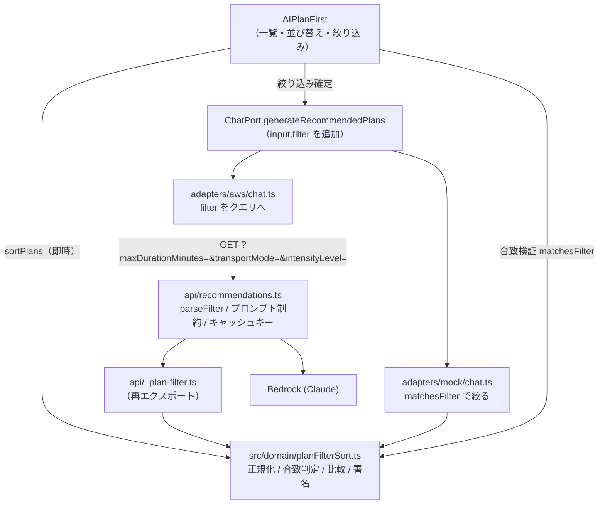

# Design Document

## Overview

`AIPlanFirst` に並び替えと絞り込みを追加する。中核は新しい純粋ドメインモジュール `src/domain/planFilterSort.ts` で、次の 4 つの責務を 1 箇所に集める。

1. 構造化メタデータ（`durationMinutes` / `transportMode` / `intensityLevel`）の正規化と補完
2. 絞り込み条件の合致判定
3. 並び替えの比較
4. 絞り込み条件の正規化と署名（キャッシュキー・クエリ文字列の生成）

サーバー（`api/recommendations.ts`）は既存の `api/_fallback-candidates.ts` と同じブリッジ方式で `api/_plan-filter.ts` 経由でこのモジュールを参照する。サーバーの正規化とクライアントの検証が同一実装になるため、両者の判定がずれない。

言語・スタイルは既存実装に合わせる（TypeScript strict / ESM、テストは Vitest + fast-check）。

## Design Decisions

### 絞り込み生成は POST ではなく GET + クエリで行う

`api/recommendations.ts` の POST 経路には 1 分 / IP のレート制限（`REFRESH_INTERVAL_MS`）と `no-store` が付いている。絞り込み条件の変更を POST にすると 2 回目の条件変更で 429 になり、CDN・サーバーキャッシュも一切効かない。

そのため絞り込みは GET のクエリパラメータに条件を載せる。条件はキャッシュキーの一部になるので、同じ条件の再選択は CDN またはサーバーキャッシュに当たり、Bedrock を再度呼ばない（Req 3.8）。POST とレート制限は従来どおり「別の5件を見る」専用に残す（Req 4.4）。

条件の組み合わせは 所要時間 4 × 移動手段 6 × 強度 4 = 96 通りに限定されるため、キャッシュキーは有界である。

### `schema` は `itinerary-v1` のまま据え置く

`schema` はクライアント（`src/adapters/aws/chat.ts`）とサーバーの両方に同じ定数が重複定義されており、不一致は 400 になる。追加する構造化フィールドは任意、`filter` はパラメータの追加のみで後方互換なので、バージョンを上げる必要がない。上げるとデプロイ途中の版ずれで全リクエストが 400 になる。

版ずれで新クライアントが旧サーバーに `filter` を送った場合、旧サーバーは未知のクエリを無視して条件なしの 5 件を返す。クライアント側の合致検証（Req 3.5）がこれを吸収し、合致件数を表示する。機能低下はするが破綻しない。

### 検証ロジックはドメインに置き、`api/` にテストを増やさない

`vite.config.ts` の `test.include` は `src/**/*.{test,spec}.{ts,tsx}` のみで、`api/**` のテストは実行されない。よって `filter` のパース・検証・正規化は `src/domain/planFilterSort.ts` の純粋関数として実装し、`api/recommendations.ts` はそれを呼ぶだけにする。テストは既存の include のまま `src/domain/planFilterSort.test.ts` で全て賄える。

### 並び替えはクライアント、絞り込みはサーバー

並び替えは取得済み配列の並べ替えだけで完結するため即時（Req 2.2）。絞り込みは 5 件固定という制約上クライアントで絞ると件数が枯れるため、条件を Bedrock に渡して条件に合う 5 件を作らせる（Req 3.3）。

## Architecture



## Data Models

### `src/domain/types.ts` への追加

```ts
/** Machine-readable transport profile used for filtering itineraries. */
export type PlanTransportMode = "walk" | "transit" | "car" | "bicycle" | "mixed";

/** Machine-readable physical effort profile used for filtering and sorting. */
export type PlanIntensityLevel = "easy" | "moderate" | "active";

export interface PlanFilter {
  /** Inclusive upper bound in minutes. */
  maxDurationMinutes?: number;
  transportMode?: PlanTransportMode;
  intensityLevel?: PlanIntensityLevel;
}

export type PlanSortKey =
  | "recommended"
  | "durationAsc"
  | "durationDesc"
  | "intensityAsc";
```

`RecommendedPlan` に任意フィールドを 3 つ追加する（既存フィクスチャを壊さないため必須にしない、Req 1.1）。

```ts
export interface RecommendedPlan {
  // ...existing fields
  /** Total itinerary length in minutes. Derived from stops when absent. */
  durationMinutes?: number;
  transportMode?: PlanTransportMode;
  intensityLevel?: PlanIntensityLevel;
}
```

`RecommendedPlansInput` に `filter?: PlanFilter` を追加する。

自由文の `duration` / `transport` / `intensity` は表示専用として無変更（Req 1.4）。

## Components and Interfaces

### 1. `src/domain/planFilterSort.ts`（新規）

依存は `./types` の型のみ。DOM・React・`import.meta`・環境変数に依存しない。

```ts
export const PLAN_TRANSPORT_MODES: readonly PlanTransportMode[] =
  ["walk", "transit", "car", "bicycle", "mixed"];
export const PLAN_INTENSITY_LEVELS: readonly PlanIntensityLevel[] =
  ["easy", "moderate", "active"];
/** Selectable upper bounds, in minutes: 3h / 6h / 10h. */
export const PLAN_DURATION_BOUNDS: readonly number[] = [180, 360, 600];
export const PLAN_SORT_KEYS: readonly PlanSortKey[] =
  ["recommended", "durationAsc", "durationDesc", "intensityAsc"];

/** Rank used by `intensityAsc`. Lower means physically easier. */
const INTENSITY_RANK: Record<PlanIntensityLevel, number> =
  { easy: 0, moderate: 1, active: 2 };
```

#### `normalizePlanMetrics(raw, stops)`

Bedrock 応答の 3 フィールドを検証し、不正・欠落なら省略する（Req 1.2）。

- `durationMinutes`: 有限数かつ整数化して 1 以上 1440 以下のときのみ採用
- `transportMode` / `intensityLevel`: 列挙に含まれるときのみ採用
- `durationMinutes` が採用されなかった場合は `deriveDurationMinutes(stops)` で補完（Req 1.3）

```ts
export function deriveDurationMinutes(
  stops: readonly { time: string }[],
): number | undefined {
  if (stops.length < 2) return undefined;
  const first = toMinutes(stops[0].time);
  const last = toMinutes(stops[stops.length - 1].time);
  if (first == null || last == null || last <= first) return undefined;
  return last - first;
}
```

`stops[].time` は `HH:MM` かつ厳密昇順に正規化済み（`api/recommendations.ts` の既存処理）なので日跨ぎは起こらず、差分は常に正になる。補完値は「最初の到着から最後の到着まで」であり、最後の滞在時間は含まない下限値として扱う。

#### `matchesFilter(plan, filter)`

指定された条件だけを評価する。条件に対応する構造化フィールドを持たない旅程は不合致（Req 6.4）。

```ts
export function matchesFilter(plan: RecommendedPlan, filter: PlanFilter): boolean {
  if (filter.maxDurationMinutes != null) {
    if (plan.durationMinutes == null) return false;
    if (plan.durationMinutes > filter.maxDurationMinutes) return false;
  }
  if (filter.transportMode != null && plan.transportMode !== filter.transportMode) {
    return false;
  }
  if (filter.intensityLevel != null && plan.intensityLevel !== filter.intensityLevel) {
    return false;
  }
  return true;
}
```

#### `sortPlans(plans, key)`

入力を破壊せず新しい配列を返す。比較キーを持たない旅程は `Number.POSITIVE_INFINITY` として末尾に寄せる（Req 2.4）。`Array.prototype.sort` は ES2019 以降で安定ソートが保証されているため、同値は入力順を保つ（Req 2.3）。`recommended` は複製のみを返す（Req 2.5）。

```ts
export function sortPlans(
  plans: readonly RecommendedPlan[],
  key: PlanSortKey,
): RecommendedPlan[] {
  const sorted = [...plans];
  if (key === "recommended") return sorted;
  const rank = (plan: RecommendedPlan): number => {
    if (key === "intensityAsc") {
      return plan.intensityLevel == null
        ? Number.POSITIVE_INFINITY
        : INTENSITY_RANK[plan.intensityLevel];
    }
    return plan.durationMinutes ?? Number.POSITIVE_INFINITY;
  };
  return sorted.sort((a, b) => {
    const left = rank(a);
    const right = rank(b);
    // Missing keys stay last in both directions, so they are never inverted.
    if (left === right) return 0;
    if (!Number.isFinite(left)) return 1;
    if (!Number.isFinite(right)) return -1;
    return key === "durationDesc" ? right - left : left - right;
  });
}
```

#### `normalizeFilter(raw)` / `isEmptyFilter(filter)` / `filterSignature(filter)`

`normalizeFilter` は文字列・数値・`null` の混在した入力（クエリ文字列、JSON ボディ、`sessionStorage`）を受け取り、妥当な値だけを残した `PlanFilter` を返す。妥当でない指定は `InvalidPlanFilterError` を投げる（サーバーは 400 に、既存の `parseExclusions` と同じ厳格方針）。

`maxDurationMinutes` は `PLAN_DURATION_BOUNDS` に含まれる値のみ許可する。任意の数値を許すとキャッシュキーが無限に増え、Bedrock 呼び出しを外部から誘発できてしまう。

`filterSignature` は条件を決定的な文字列にする。順序固定・未指定は省略・空なら `"all"`。

```ts
export function filterSignature(filter: PlanFilter): string {
  const parts: string[] = [];
  if (filter.maxDurationMinutes != null) parts.push(`d${filter.maxDurationMinutes}`);
  if (filter.transportMode != null) parts.push(`t${filter.transportMode}`);
  if (filter.intensityLevel != null) parts.push(`i${filter.intensityLevel}`);
  return parts.length === 0 ? "all" : parts.join("-");
}
```

### 2. `api/_plan-filter.ts`（新規）

`../src/domain/planFilterSort.js` からブリッジとして再エクスポートするだけのファイル。`api/` から `src/` への import をこの 1 ファイルに閉じる（`_fallback-candidates.ts` と同じ方式）。

### 3. `api/recommendations.ts` の変更

- `RawPlan` に `durationMinutes` / `transportMode` / `intensityLevel` を追加し、`normalizePlan` の末尾で `normalizePlanMetrics` の結果を展開する。`stops` 正規化後に呼ぶので補完に確定した時刻を使える。
- リクエストパース: `source` から 3 つのフィルタ値を読み、`normalizeFilter` に渡す。`InvalidPlanFilterError` は既存の `InvalidRequestError` と同様に 400 で返す。
- `recommendationsFor` の `cacheKey` を `${schema}:${date}:${lang}:${filterSignature(filter)}` にする（Req 3.8）。`requestKey` も同じ基底を使う。
- `recommendationCache` に上限を設ける。既存の期限切れ掃除に加えて、`MAX_CACHE_ENTRIES = 200` を超えたら挿入順で古いものから捨てる。条件の組み合わせ × 言語でキーが増えるため、無制限にしない。
- `recommendationPrompt` に条件があるときだけ制約行を追加する。

```ts
...(filter.maxDurationMinutes != null ? [
  `5件すべて、最初の立寄先から最後の立寄先までを${filter.maxDurationMinutes}分以内に収めてください。`,
] : []),
...(filter.transportMode != null ? [
  `5件すべての主な移動手段を ${TRANSPORT_PROMPT[filter.transportMode]} にしてください。`,
] : []),
...(filter.intensityLevel != null ? [
  `5件すべての体力的な負荷を ${INTENSITY_PROMPT[filter.intensityLevel]} にしてください。`,
] : []),
```

- 出力 JSON の例に `"durationMinutes":240,"transportMode":"transit","intensityLevel":"moderate"` を追加し、`transportMode` と `intensityLevel` の取り得る値を明記する。自由文 `duration` / `transport` / `intensity` は表示用として引き続き要求する。

`TRANSPORT_PROMPT` / `INTENSITY_PROMPT` はプロンプト用の日本語表現（例 `transit` → 「公共交通（電車・バス・路面電車）」）を持つ `Record`。プロンプトは既存どおり常に日本語で、表示文言のみ `lang` に従う。

### 4. `src/adapters/aws/chat.ts` の変更

`generateRecommendedPlans` で `input.filter` があればクエリに追加する。POST 経路（refresh）でも同じ値をクエリとボディの両方に載せ、既存の「クエリとボディの一致」検証と整合させる。

```ts
const filter = input.filter ?? {};
if (filter.maxDurationMinutes != null) {
  query.set("maxDurationMinutes", String(filter.maxDurationMinutes));
}
if (filter.transportMode != null) query.set("transportMode", filter.transportMode);
if (filter.intensityLevel != null) query.set("intensityLevel", filter.intensityLevel);
```

応答の `plans` は 5 件チェックのみ既存どおり。構造化フィールドの検証はクライアント側の `isTourismRecommendations` に委ねる（存在すれば型を検証、無ければ許容）。

### 5. `src/adapters/mock/chat.ts` の変更

- `MOCK_RECOMMENDATIONS` の 5 件に `durationMinutes` / `transportMode` / `intensityLevel` を付与する。既存の自由文（「約3時間」「路面電車＋徒歩」など）と矛盾しない値を選ぶ。
- `generateRecommendedPlans` が `input.filter` を受けて `matchesFilter` で絞った結果を返す。モックは固定 5 件なので条件次第で 5 件未満・0 件になる。これは意図した挙動で、空状態（Req 3.6）と合致件数表示（Req 3.5）をモック環境で確認できるようにする（Req 6.3）。

### 6. `src/ui/screens/AIPlanFirst.tsx` の変更

#### 状態

```ts
const [sortKey, setSortKey] = useState<PlanSortKey>("recommended");
/** Conditions already reflected in `plans`. */
const [appliedFilter, setAppliedFilter] = useState<PlanFilter>({});
/** Conditions edited in the controls but not yet submitted. */
const [draftFilter, setDraftFilter] = useState<PlanFilter>({});
```

`sortKey` / `appliedFilter` / `draftFilter` は `lang` 変更や再生成で初期化しない（Req 2.6、Req 5.4）。

#### キャッシュとリクエストの鍵

`RECOMMENDATIONS_CACHE_VERSION` を `v7-itinerary-metrics-v1` に更新する（Req 1.5）。`storageKey` と `requestCache` の内側 Map のキーに条件署名を含める。

```ts
function storageKey(lang: LangCode, filter: PlanFilter): string {
  return [
    "ehime-recommendations",
    RECOMMENDATIONS_CACHE_VERSION,
    recommendationDate(),
    lang,
    filterSignature(filter),
  ].join(":");
}
```

`requestCache` は `WeakMap<ChatPort, Map<string, Promise<RecommendedPlan[]>>>` になり、内側のキーは `${lang}|${filterSignature(filter)}`。

#### `isTourismRecommendations` の拡張

`plans.length === 5` と `stops` の既存検証は維持したうえで、構造化フィールドは「存在するなら妥当」を検証する。生成結果の合致判定はこの検証の後に別途行う。

#### 表示の導出

```ts
const matched = useMemo(
  () => plans.filter((plan) => matchesFilter(plan, appliedFilter)),
  [plans, appliedFilter],
);
const visible = useMemo(() => sortPlans(matched, sortKey), [matched, sortKey]);
```

`appliedFilter` が空なら `matched === plans` と等価になり、既定状態では従来と同じ内容・順序になる（Req 6.1）。

#### コントロール UI

`plan-first__count` の下に新しい `<section className="plan-first-controls">` を置く。ネイティブの `<select>` を使う。カスタムウィジェットを作らないことでキーボード操作とスクリーンリーダー対応が既定で成立する（Req 5.2）。`TravelerLoadingIllustration` と同様、この画面ファイル内のローカルサブコンポーネントとして実装する。

- 並び替え: `<select>` 1 つ。`onChange` で `setSortKey` のみ（fetch しない、Req 2.2）
- 絞り込み: `<select>` 3 つ（所要時間上限・移動手段・強度、各先頭に「指定なし」）＋「この条件で探す」＋「条件をクリア」
- 「この条件で探す」は `draftFilter` と `appliedFilter` が同値のとき、または生成中のとき `disabled`
- 生成中は 3 つの `<select>` と両ボタンを `disabled`、コンテナに `aria-busy`（Req 4.1）

条件の反映は明示的な確定操作のみで行う。`<select>` の変更ごとに生成すると、1 回の操作で複数回 Bedrock を呼びうる。

#### ライブリージョン

コントロール直下に常設の `role="status"` を置き、合致件数と並び替えの状態を文字列で出す（Req 3.5、Req 5.3）。要素を条件付きで生成すると読み上げが安定しないため、要素は常に描画してテキストだけ差し替える。

```tsx
<p className="plan-first-controls__status" role="status">
  {t("planFirst.filterStatus")
    .replace("{matched}", String(visible.length))
    .replace("{total}", String(plans.length))}
</p>
```

#### 絞り込みの適用フロー

```ts
const applyFilter = useCallback(async (next: PlanFilter): Promise<void> => {
  setFiltering(true);
  setFilterError("");
  try {
    const fetched = await recommendations(chat, lang, next);
    setPlans(fetched);
    setAppliedFilter(next);
  } catch (error) {
    // Keep the current list and the applied conditions on failure (Req 4.2).
    setFilterError(error instanceof Error ? error.message : t("planFirst.loadError"));
  } finally {
    setFiltering(false);
  }
}, [chat, lang, t]);
```

失敗時は `plans` と `appliedFilter` を触らないため、直前の一覧がそのまま残る（Req 4.2）。エラーは既存の `plan-first__refresh-error` と同じ `role="alert"` で表示する。

#### 空状態

`status === "ready"` かつ `visible.length === 0` のとき、一覧の代わりに `plan-first-status` カードで空状態メッセージと「条件をクリア」を表示する（Req 3.6）。

#### 既存動作の維持

`openPlan` / 詳細表示 / `onStart` は無変更（Req 6.2）。「別の5件を見る」は `appliedFilter` を維持したまま `refresh: true` と `exclude` を付けて呼ぶ（Req 4.4）。詳細画面から戻ったときの `plans` は保持されるため、並び替え・絞り込みの状態も維持される。

### 7. `src/i18n/labels.ts` への追加

ja / en / iyo の 3 言語すべてで追加する（Req 5.1）。未定義言語は既存の `resolveLabels` のフォールバックに従う。

| キー | 用途 |
| --- | --- |
| `planFirst.sortLabel` | 並び替え `<select>` のラベル |
| `planFirst.sort.recommended` | AIおすすめ順 |
| `planFirst.sort.durationAsc` | 所要時間が短い順 |
| `planFirst.sort.durationDesc` | 所要時間が長い順 |
| `planFirst.sort.intensityAsc` | 強度が軽い順 |
| `planFirst.filterTitle` | 絞り込みセクションの見出し |
| `planFirst.filter.any` | 指定なし（3 つの `<select>` で共用） |
| `planFirst.filter.durationLabel` | 所要時間上限のラベル |
| `planFirst.filter.duration180` / `duration360` / `duration600` | 3時間以内 / 6時間以内 / 10時間以内 |
| `planFirst.filter.transportLabel` | 移動手段のラベル |
| `planFirst.filter.transport.walk` / `.transit` / `.car` / `.bicycle` / `.mixed` | 移動手段の選択肢 |
| `planFirst.filter.intensityLabel` | 強度のラベル |
| `planFirst.filter.intensity.easy` / `.moderate` / `.active` | 強度の選択肢 |
| `planFirst.filter.apply` | この条件で探す |
| `planFirst.filter.applying` | 条件に合う旅を生成中 |
| `planFirst.filter.clear` | 条件をクリア |
| `planFirst.filterStatus` | `{matched}` / `{total}` を差し込む合致件数 |
| `planFirst.filterEmpty` | 空状態メッセージ |
| `planFirst.filterError` | 条件付き生成の失敗メッセージ |

差し込みは既存の `String.replace("{...}", ...)` 方式に揃える。

### 8. `src/ui/styles/screens.css` への追加

既存の `plan-first-*` 命名に合わせて追加する。

- `.plan-first-controls`（縦積みのコンテナ）
- `.plan-first-controls__row`（`<select>` を折り返し可能に並べる）
- `.plan-first-controls__field`（ラベルと `<select>` の縦組み）
- `.plan-first-controls__actions`（確定・クリアボタン）
- `.plan-first-controls__status`

`<select>` はフォーカスリングに既存の `var(--focus-ring)` を使い、他のフォーム要素と一致させる。

## Error Handling

| 状況 | 扱い |
| --- | --- |
| `filter` の値が列挙外・許可外の数値 | サーバーは `InvalidPlanFilterError` → 400。クライアントは `<select>` しか使わないため通常発生しない |
| Bedrock が構造化フィールドを返さない | 当該フィールドを省略。`durationMinutes` は時刻から補完。並び替えでは末尾、絞り込みでは不合致（Req 1.2、Req 6.4） |
| 生成結果が条件を満たさない | 一覧から除外し、合致件数を表示（Req 3.5）。0 件なら空状態（Req 3.6） |
| 条件付き生成の失敗（429 / 502 / ネットワーク） | 一覧と `appliedFilter` を保持し `role="alert"` で表示。再操作可能（Req 4.2） |
| 初回読み込みの失敗 | 既存の全画面エラーと再試行を維持（Req 4.3） |
| `sessionStorage` が使えない | 既存の try/catch のまま。キャッシュなしで動作 |
| 旧形式のキャッシュ | キャッシュバージョン更新によりキーが一致せず無視される（Req 1.5） |

## Testing Strategy

新規テストは 3 ファイル。既存テストは変更しない（変更が必要になったら非回帰が崩れた合図として扱う）。

- `src/domain/planFilterSort.test.ts` — fast-check によるプロパティテスト（下記 Property 1〜9）
- `src/ui/screens/AIPlanFirst.test.tsx` — React Testing Library による例示テスト
- `src/i18n/planFilterLabels.test.ts` — 追加キーの言語網羅（全数検査）

`api/**` は `test.include` の対象外なので、サーバー側の判定ロジックは `src/domain/planFilterSort.ts` のテストで担保する。`api/recommendations.ts` に残るのは配線のみ。

型検証は既存どおり `npm run typecheck` と `node node_modules/typescript/bin/tsc --noEmit -p api/tsconfig.json` の 2 本を実行する。

### Property 1: 並び替えは並べ替えに過ぎない

*For any* 旅程配列と並び替えキーについて、`sortPlans` の結果は入力の順列であり、長さが等しく、入力配列を変更しない。

**Validates: Requirements 2.2, 6.1**

### Property 2: 並び替えは単調

*For any* 旅程配列について、`durationAsc` の結果で `durationMinutes` を持つ要素だけを取り出した列は非減少、`durationDesc` では非増加、`intensityAsc` では強度ランクが非減少になる。

**Validates: Requirements 2.1**

### Property 3: 比較キー欠落は末尾

*For any* 旅程配列と `recommended` 以外の並び替えキーについて、比較キーを持たない要素はすべて、比較キーを持つ要素より後ろに位置する。

**Validates: Requirements 2.4, 6.4**

### Property 4: 同値は入力順を保つ

*For any* 比較キーが同値な要素を含む旅程配列について、それらの相対順序は入力順と一致する。

**Validates: Requirements 2.3**

### Property 5: `recommended` は恒等

*For any* 旅程配列について、`sortPlans(plans, "recommended")` は要素順が入力と完全に一致する。

**Validates: Requirements 2.5, 6.1**

### Property 6: 空条件は全件合致

*For any* 旅程について、`matchesFilter(plan, {})` は真。よって既定状態の一覧は元の 5 件と一致する。

**Validates: Requirements 3.2, 6.1**

### Property 7: 合致した旅程は条件を満たす

*For any* 旅程と条件について、`matchesFilter` が真なら、指定された各条件について対応する構造化フィールドが存在し、所要時間は上限以下、移動手段と強度は指定値と一致する。指定条件に対応するフィールドが欠落していれば偽になる。

**Validates: Requirements 3.5, 6.4**

### Property 8: 条件署名は正規形

*For any* 条件について、`filterSignature` は指定順序に依存せず同一条件で同一文字列を返し、異なる条件では異なる文字列を返す。空条件は `"all"` を返す。

**Validates: Requirements 3.7, 3.8, 1.5**

### Property 9: メタデータ正規化は列挙と範囲を守る

*For any* 任意の値（数値・文字列・null・オブジェクト）と `stops` について、`normalizePlanMetrics` の結果は、`transportMode` / `intensityLevel` が未定義または列挙の要素であり、`durationMinutes` は未定義または 1 以上 1440 以下の整数である。`durationMinutes` が不正・欠落かつ `stops` が 2 件以上で時刻が昇順なら、結果は最初と最後の時刻差に一致する。

**Validates: Requirements 1.2, 1.3**

### 例示テスト（`AIPlanFirst.test.tsx`）

| 確認内容 | 対応要求 |
| --- | --- |
| 並び替え変更で `generateRecommendedPlans` が追加呼び出しされず、カード順が変わる | 2.2 |
| 「この条件で探す」で `filter` 付きの呼び出しが 1 回だけ発生する | 3.3 |
| 条件に合わない旅程が一覧から消え、合致件数が `role="status"` に出る | 3.5 |
| 合致 0 件で空状態と「条件をクリア」が出る | 3.6 |
| 条件クリアで条件なしの一覧に戻る | 3.7 |
| 生成中はコントロールが `disabled` かつ `aria-busy` で、一覧が残る | 4.1 |
| 生成失敗で一覧が残り `role="alert"` が出て、再操作できる | 4.2 |
| 言語切替後も並び替え・絞り込みの選択が保持される | 5.4 |
| 既定状態のカード順が API 応答順と一致する | 6.1 |
| カード選択で `onStart` が選んだ旅程で呼ばれる | 6.2 |

## Notes

- 条件の組み合わせは 96 通り。サーバーのメモリキャッシュは 15 分 TTL と挿入順の上限 200 件で有界にする。
- モックは固定 5 件なので、条件次第で 5 件未満になる。これは開発時に空状態と合致件数表示を確認できる利点として受け入れる。
- 版ずれ（新クライアント + 旧サーバー）では絞り込みが効かず、クライアント検証で件数が減る。破綻はしないが、デプロイ後に条件付き生成が機能しているかは合致件数で確認できる。
- `durationMinutes` の補完値は最後の滞在時間を含まない下限値。Bedrock が値を返せば常にそちらを優先する。
